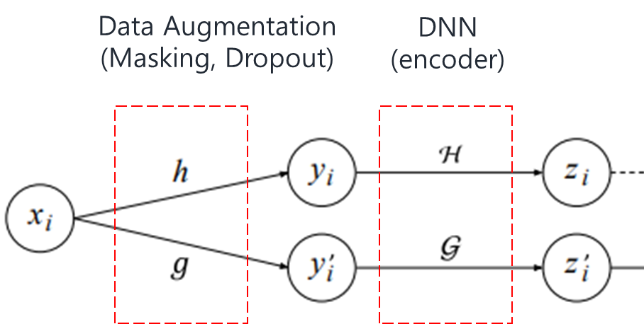
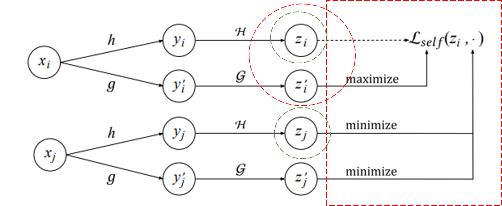
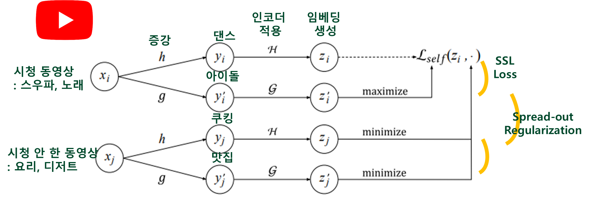
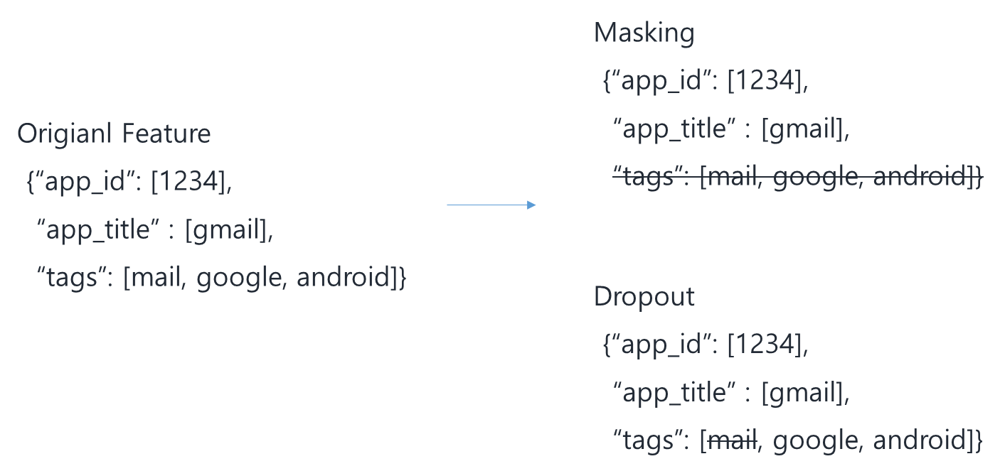

<br>

# Self-supervised Learning for Large-scale Item Recommendations


ML과 DL에서 나오는 중요한 용어들이 잔뜩 축약되어 있는 논문이다.
나에겐 읽을 때 너무너무 어려웠지만.. 그래도 한 번 발표하고 나니 애증의 논문이 되었다..ㅎㅎ 내가 이해하려고 적다보니 이 포스팅에는 중복되는 내용도 많을 수 있다. 이 포스팅에서는 **Method 위주로 정리**해보겠다.


<br>

## Authors

#### Tiansheng Yao, Xinyang Yi, Derek Zhiyuan Cheng, Felix Yu, Ting Chen, Aditya Menon, Lichan Hong, Ed H. Chi, Steve Tjoa, Jieqi (Jay) Kang, Evan Ettinger. Google Inc., United States

저자들은 대부분 google research에서 연구원으로 근무하고 있다. 추천시스템, 자기지도학습, ML, DL 등을 연구하고 있었다. 특히 Ting Chen이라는 분은 이전에 썼던 논문을 기반으로 이 논문에는 contribution 정도로 참여한 것으로 보인다(고 교수님이 설명해주셨다ㅎㅎㅎ).


그리고, 조사를 하다 보니 Tiansheng Yao 연구원은 유튜브나 다양한 곳에서 관련 논문과 recommendations, two-tower model을 소개한 영상들이 꽤 있었다.


<br>

## Introduction

기존 시스템에서는 SSL이 사용되지 않았다. 왜냐하면 공용으로 인정될만한 Dataset도 없을 뿐더러, 도메인이 바뀔 때 마다 추천시스템 기능(성능)이 다르기 때문에 사용되기가 어렵다는 단점이 있었다.


SSL은 computer vision이나 nlp에서는 text data가 있고, 성공적으로 쓰이고 있지만 categorical feature에서는 쓰이기가 힘들었다. 그래서, 이 논문에서는 이러한 categorical 형에서도 다양한 data augmentation을 제안하여 좋은 성능을 낸 것을 소개하고 있다. 


어쩄든, 추천 시스템은 방대한 항목 중 관련성 있는 것을 찾아내지만, 데이터 희소성 문제에 직면하고 있다. 이를 해결하기 위해, 자기 지도 학습(SSL) 프레임워크를 제안하며, 이는 항목 피처의 연관성을 학습하고 일반화를 개선한다. 새로운 데이터 증강 방법도 소개되었고, 실제 데이터셋에서의 테스트 결과 SSL은 우수한 성능을 보여줬다.


기존 시템에서는 수십억개에 달하는 범주형에서 모두 모델링한다고 했을 때, 일부에 대해서는 데이터가 희소할 수 있다. 사람들이 자주 찾지 않는 주제와 같은 것들을 생각하면 된다. 이럴 때 데이터가 고편향되어있다고(long-tailed items) 볼 수 있고, 사용자의 만족도와 평가와 같은 명시적인 피드백을 받기가 어렵다. 다만 암묵적인 유튜브 좋아요, 조회수 등만을 제공받을 수 있다.  


```
• Highly-skewed data distribution: The interaction between queries and items are often highly skewed in a power-law distribution [30]. So a small set of the popular items gets most of the interactions. This will always leave the training data for long-tail items very sparse.

• Lack of explicit user feedback: Users often provide lots of positive feedback implicitly like clicks and thumb-ups. However, they are much less likely to provide explicit feedback like item ratings, feedback for user happiness, and relevance scores
```


**이러한 문제로** label의 희소성 문제를 해결하기 위해서 

- item, category간의 잠재적 관계를 잘 학습해야하고,

- 상관관계를 가지면서 데이터를 증강해야하고, 

- 정규화를 잘 시켜야한다.


어쨌든, 결론적으로는 

- 수 억 개의 훈련 예제가 포함된 데이터셋을 활용하여 평가하였을 때, SSL정규화가 최신 정규화 기법보다 더 우수한 성능을 보였고, 

- 웹 규모 상용 앱 간 추천 시스템에 도입하여 실시간 트래픽에 대한 A/B 테스트 결과  상당한 개선된 비즈니스 메트릭스 결과를 보여주고,

- 라벨이 부족한(피드백이 적은) 데이터에서 모델 성능 향상 검증이 되었다.


<br>

## Method


### Framework

 추천 시스템을 위한 DNN모델에 대한 SSL 프레임워크 소개 이것은 대규모 신경 추천 모델에 적합한 자기 지도 학습 프레임워크이며, 범주형 특징을 다루기 위한 새로운 데이터 증강 방법을 소개하고 있다.


 프레임워크는 범주형 특징(제품 카테고리 등)을 표현하고 있다. 기본 이 프레임워크는 SimCLR랑 같은데, SimCLR은 이미지이기 때문에, 크롭, 리사이징, 로테이션 같은 것들을 가져왔다면, 여기서는 categorical feature에 대한 data aug에 중점을 둔다.


기본적인 SSL Framework이다.


두 가지 스텝으로 구성된다.


<br>

#### step 1



먼저, 입력데이터가 들어오면 f(h), f(g) 함수를 써서 2방향으로 Masking이나 Dropout과 같은 data augmentation을 한다.

이후, DNN을 사용하여 encoding을 한다. 이 때, 훈련 example인 (x_i)의 raw특성을 인코더 H, G를 적용하여 확장해서 z_i, z_i' 임베딩을 생성한다. 

data augmentation은 기존 데이터를 조금씩 변형해서 학습데이터를 증강시키고, 이를 통해 모델이 더 다양한 데이터에 학습할 수 있게 되어 과적합을 방지할 수 있는 장점이 있다.


<br>

#### step 2





인코더가 적용이 되어 생성된 임베딩 z_i, z_i'이 생성되고, SSL의 손실함수인 L_self는 임베딩 z_i에 최적화한다. 이 최적화의 목표는 같은 데이터 인풋 x_i에서 파생된 z_i, z_i'사이의 유사성을 최대화하는 것이다. 하지만, 다른 데이터 x_j에서 온 z_j와 z_j'의 유사성은 최소화해야한다.


<br>

#### 중간 정리


h,g함수 써서 x_i의 다른 증강 버전 생성 데이터를 고차원에서 저차원 변환하여 저차원의 벡터는 해당하는 데이터의 중요특성 포착한다.


인코더 H,G써서 임베딩 얻고, 이 임베딩은 동영상 메타데이터(카테고리: 엔터/음식? 뭐 이런게있다면..) 저차원의 벡터로 변환한다.


이렇게 임베딩 하는 이유는, 실제 데이터는 노이즈나 필요없는 정보가 많으니 노이즈 같은 필요없는 것들을 제거하여서 계산 비용을 줄이는 것이는 것이다. 이렇게 저차원 벡터로 압축하면 비슷한 데이터 포인트들이 임베딩 공간에서 가까이 위치하고(비슷한 것 끼리 묶이는 것 같음), 그렇게 되면 밀집된 표현은 일반화 성능을 증가시키고 오버피팅도 줄일 수 있는 것이다.


인코더는 데이터를 받아서 다른 형태로 변환해주는 것이고, 이 때 저차원으로 변환된다는 것은 벡터 공간 내에서 가까이 위치한 유사성이 높은 것은 모으고 그렇지 않은 것들은 지우는 것이다. 그래서 인코더를 적용하면 데이터를 처리해서 새로운 표현(임베딩)으로 만든다.


SSL Loss에서는 z_i와 z’_i 유사성 최대화 할라고 시도한다. 둘 다 같은 동영상 xi에서 왔으니까 둘 사이에서는 유사성이 있어야하고,


당연히 zi와 z_i사이에서는 유사성이 당연히 다른 동영상이니 최소화 하려한다.


이러한 방식으로, 유튜브는 사용자가 시청한 동영상과 유사한 동영상을 임베딩 공간에서 찾아 사용자에게 추천하고, SSL 쓰면 라벨이 없는 많은 데이터를  활용하여 효과적인 임베딩 학습가능하다.


이런 loss는 비슷한 데이터 포인트의 임베딩들이 가깝게 (즉, 유사성이 높게) 되도록 하고, 서로 다른 데이터 포인트의 임베딩들이 멀어지도록 (즉, 유사성이 낮게)한다. 


또 여기서 추가로 나오는게 Spread-out Regularization인데, 이건 서로 다른 데이터 간에는 임베딩이 너무 가깝게 모여 있지 않도록 하기 위해 사용된다. 이는 모델이 다양한 아이템을 구별하는 능력을 강화하려고 한다.


결국 loss와 Spread out regularizaiotn은 보완적인 관계인 것 같다.


> Lself​는 self-supervised learning의 loss function을 의미함.

> "w.r.t."는 "with respect to"의 약자로, 미적분에서 특정 변수에 대한 함수의 변화율을 의미. 예를 들어, zi​에 대한 Lself​의 변화율, 즉 그래디언트를 의미.


<br>

#### example


조금 예를 들자면, 




유튜브 추천시스템을 생각해보자. 예시가 조금 다르긴 하지만, 쉽게 생각하기 위해서 써본다. 내가 만약 스우파, 노래와 관련된 영상을 많이본다면, 증강을 써서 비슷한 댄스, 아이돌과 같은 증강버전을 만들어낸다. 그리고 인코더를 적용해서 댄스나 아이돌과 관련된 중요 정보들만 모은 새로운 임베딩을 생성한다. 그러면 벡터가 저차원이 되면서 경제적인 처리가 가능하다. 내가 시청한 동영상에서 생성된 z_i와 z_i'는 유사해야 할 것이고, 이를 통해 유사성을 강화하여 새로운 동영상을 추천한다.


하지만 내가 보지 않는 요리나 디저트같은 영상이라면, 그들 사이에는 유사성이 있을지 몰라도 x_i에서 유래된 것과는 차이가 있어야한다. 유사하지 않은 데이터 간에는 임베딩이 가깝제 모여있지 않도록, 손실함수를 minimize할 수 있게 spread-out regularization을 사용한다.


<br>

### Two-tower Augmentation

그럼 이 증강을 어떻게 하느냐?! 두 가지 방법이 있다. 증강은 모델이 더 다양한 상황에서 일반화된 학습을 할 수 있도록 데이터를 증강하는 것이다.


<br>

#### Masking

 1. Masking : 항목 특징 집합에 마스킹 패턴을 적용. 입력 계층에서 마스킹 된 특징을 나타내기 위해 기본 임베딩을 사용함.

<br>

#### Dropout

 2. Dropout : 각 범주형 특징 값 중 일부를 무작위로 제거하여, 추가로 입력 정보를 줄이고 SSL 작업 난이도를 높임.


즉.. 쉽게 말하면 마스킹은 특정 특징들을 숨기는 것이고, 드롭아웃은 범주형 특징 값들 중 일부를 확률적으로 제거하는 것이다. 


예를 들자면,



마스킹에서는 tags라는 특정 특징을 숨기고, dropout에서는 tags에 있는 범주형 특징 값 중 일부인 mail을 제거한 것이다.


<br>

### Multi-task Training


멀티태스킹의 목적은 SSL을 통해 학습된 표현이 주요 지도학습 작업 (예: 회귀 또는 분류)에 대한 학습을 향상시키도록 하기 위함이다.

Co-training the ssl task together with the primary task(supervised)로, main supervised task와 auxiliary SSL tastk을 동시에 최적화하는 멀티태스크 트레이닝 전략을 적용한다.


이를 통해 얻을 수 있는 인사이트는 다음과 같다.

- insight1: the ssl loss is regularization,

- Insight2: heterogeneous distribution of the ssl loss helps learning from long-tailed marginal distributions.


SSL 작업과 지도 학습 작업을 동시에 혹은 함께 훈련시켜 모델의 성능을 향상
지도 학습의 레이블된 데이터의 장점과 자기 지도 학습의 레이블이 없는 데이터를 활용하는 장점을 동시에 얻을 수 있다.

예를 들자면, 

Main Task에서는 사용자 과거 시청기록, 검색기록, 클릭기록 -> 다음 볼 영상 추천하는 것이고,

Auxiliary Task(SSL Task)에서는 영상 내용, 메타데이터 활용하여 유사 영상 클러스터링하고, 영상 자체의 특성(제목, 내용, 설명, 태그) 활용하여 추천 성능 향상 시킬 수 있는 것이다.


위 model architecture에서 보듯, west two-tower에서는 사용자 query를 받아 임베딩하고, east에서는 item feature로 Supervised loss를 계산한다. 그리고 오른쪽 two-tower에서는 augmentation을 한 것들을 SSL한, SSL loss를 계산하여 큰 두 타워가 share하여 추천시스템을 향상시킬 수 있는 것이다.


<br><br><br>
끝🙂

<br><br><br>


